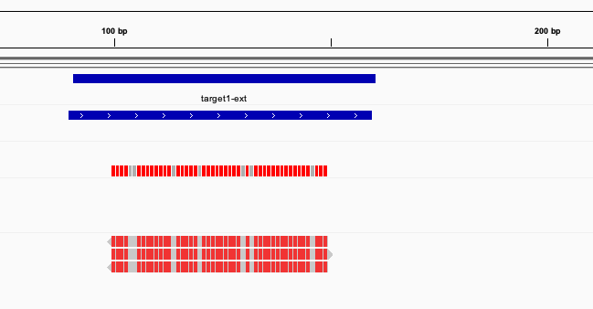
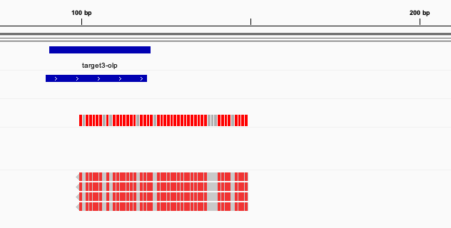

# Multiple chromosome dataset

* Chr1
  


* Chr2


* Chr3



## Output

* Feature counts (featureCounts)

```text
# Program:featureCounts v2.0.1; Command:"featureCounts" "-a" "annotation.gtf" "-o" "featureCounts" "reads.bam" 
Geneid         Chr     Start  End    Strand  Length  reads.bam
target1-ext    chr1    90     159    +       70      3
target2-int    chr2    110    119    +       10      4
target3-exact  chr3    100    149    +       50      4
```

* Coverage (Mosdepth)

```text
chr1    90    160    target1-ext    2.14
chr2    110   120    target2-int    4.00
chr3    90    120    target3-olp    2.80
```
