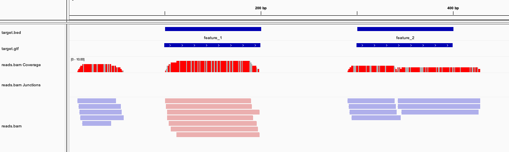

# Tiny target dataset



## Source files

* `target.bed` is the original target
* `reads.bed` is the list of reads

## Produced files

* `ref.fa` is a random reference (generated for IGV)
* `reads.bam` is the alignment file
* `target.gtf` is the target for featureCounts
* `fc` is FeatureCounts output (counts)
* `mos-target.regions.bed` is Mosdepth output (coverage)

A **Makefile** produces all file but mosdepth

## Output files

* Counts

```text
# Program:featureCounts v2.0.1; Command:"featureCounts" "-a" "target.gtf" "-o" "fc" "reads.bam" 
Geneid	Chr	Start	End	Strand	Length	reads.bam
feature_1	seq1	100	199	+	100	7
feature_2	seq1	300	399	+	100	7
second_half	seq1	500	999	+	500	0
```

* Coverage

```text
seq1    100     200     feature_1       6.30
seq1    300     400     feature_2       3.35
seq1    500     1000    second_half     0.00
```
